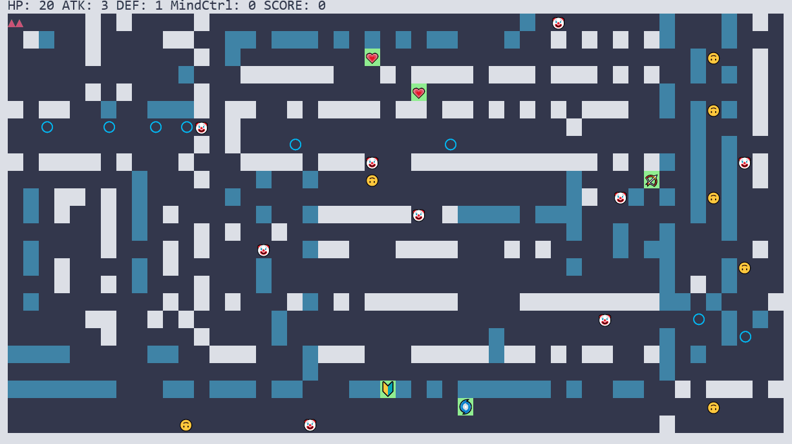

# Adventure

基于 ncurses 的控制台冒险游戏



## 安装方法

### ASCII版本

1. `sudo apt install libncurses5-dev`
2. `mkdir build && cd build`
3. `cmake ..`
4. `cmake --build .`

### Unicode版本

1. `sudo apt purge libncurses-dev`
2. `sudo apt install libncursesw5-dev`
2. `mkdir build && cd build`
2. `cmake -DUSE_UNICODE=on ..`
2. `cmake --build .`

需要注意，unicode版本兼容性较差，例如在windows命令行下会乱码

你也可以通过Docker来构建：

```bash
docker build -t adventure .
docker run --rm -it adventure
```

## 规则说明

- 角色A攻击角色B时，B的体力值的减少量是A的攻击值与B的防御值之差。特别地，当A的攻击值小于B的防御值时，不对B造成伤害，例如初始化时，玩家便无法对围墙造成伤害
- 对敌人的伤害会等量地转化为玩家的得分，玩家的目的是获得更多的得分
- 但需要注意，随着得分的增加，新生成的敌人的各项能力值也会随之增加，因此，你需要通过各种药水来强化自身的能力值

## 玩家操作

- `w` `s` `a` `d` 分别代表上下左右移动或调整方向
- 空格表示发射箭矢
- `c` 表示使用精神控制药水
- `p` 表示暂停/恢复游戏
- `Q` 表示退出游戏

## 物品与角色

| 名称         | ascii字符                                                    | unicode字符                                                  | 介绍                                                         |
| ------------ | ------------------------------------------------------------ | ------------------------------------------------------------ | ------------------------------------------------------------ |
| 玩家         | `A` `V` `<` `>`                                              | ▲▲ ▼▼ ⮜⬤  ⬤➤                                                 | 见[玩家操作](#玩家操作)                                      |
| 普通弓箭手   | `X`                                                          | 🤡                                                            | 随机在地图中游走，随机发射箭矢                               |
| 智能弓箭手   | `X`                                                          | 🤡                                                            | 追踪玩家并发射箭矢攻击玩家                                   |
| 普通剑士     | `O`                                                          | 🙃                                                            | 随机在地图中游走，如果触碰到它会受到伤害                     |
| 智能剑士     | `O`                                                          | 🙃                                                            | 追踪玩家并攻击玩家                                           |
| 箭           | `*`                                                          | 〇                                                           | 径直往前运行，攻击碰到的物体后消失                           |
| 攻击药水     | `!`                                                          | 🏹                                                            | 玩家接收后，攻击值加1                                        |
| 防御药水     | `U`                                                          | 🔰                                                            | 玩家接收后，防御值加1                                        |
| 恢复药水     | `+`                                                          | 💗                                                            | 玩家接收后，体力值加3                                        |
| 精神控制药水 | `@`                                                          | 🌀                                                            | 玩家接收后，按 `c` 发动，效果是使以玩家为中心半径3单位内的所有敌方单位被精神控制，去攻击敌方 |
| 普通围墙     |  |  | 可以被玩家攻击破坏的围墙                                     |
| 坚固围墙     |  |  | 不可以被玩家攻击破坏的围墙                                   |

